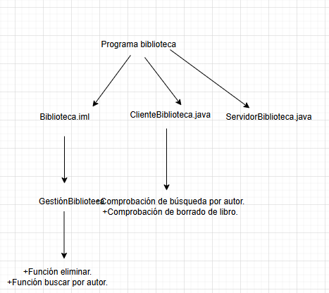

# Práctica 3: Biblioteca CORBA

## Tecnologías y versiones utilizadas

- **Java**: 8
- **IDL Compiler (`idlj`)**
- **CORBA**
- **IntelliJ IDEA**

---

## ️ Ejecución de la práctica

Para ejecutar esta práctica, hay que abrir tres consolas y ejecutar
primero los comandos para iniciar el puerto, luego el servidor y luego el cliente.

### Apartado 2
#### a)
Para hacer este apartado, en vez de ejecutar los los comandos
en ese orden, inicias el puerto y luego el cliente. Tras esto,
observas lo que pasa.

#### b)
En este caso, utilizas primero el comando de iniciar el servidor
en dos terminales distintas y luego el del cliente.

#### c)
Los dos compañeros se conectan a la misma red y luego
se iniciliza un servidor en el pc de un compañero y en el del otro
el clente con la dirección adecuada.

### Apartado 3

Se proceda a modificar el código proporcionado en la práctica
para añadir las funciones propuestas. En nuestro caso, hemos añadidio las dos.

### Apartado 4

